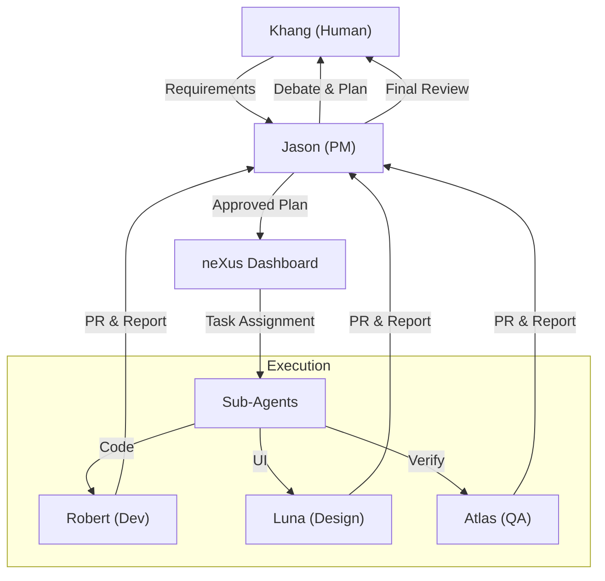

<p align="center">
  
</p>

<h1 align="center">neXus</h1>

<p align="center">
  <strong>The Operating System for Autonomous Engineering Teams.</strong><br/>
  <em>Orchestrating multi-agent collaboration with persistent memory and state.</em>
</p>

<p align="center">
  <a href="#team">The Team</a> · <a href="#workflow">Workflow</a> · <a href="#stack">Tech Stack</a> · <a href="#getting-started">Getting Started</a> · <a href="#roadmap">Roadmap</a>
</p>

---

## The Vision

> **"Agents shouldn't just chat. They should work."**

neXus is not just another dashboard. It is the central nervous system for a fully autonomous engineering team. It solves the fragmentation problem of AI coding agents by providing a shared reality—a persistent state where memory, context, and decisions live beyond a single session.

In neXus, agents aren't ephemeral scripts. They are **teammates**.

---

## The Team Model

neXus manages a specific hierarchy of specialized agents, mirroring a high-performing human engineering pod.

| Agent | Role | Responsibility |
|-------|------|----------------|
| **Jason** 🧠 | **Project Manager / Orchestrator** | The "Brain". Interacts with the human owner (Khang), manages the roadmap, breaks down high-level requirements into technical tasks, and unblocks the team. |
| **Robert** 🖐️ | **Fullstack Lead** | The "Hands". Senior engineer responsible for core architecture, complex backend logic, and maintaining code quality standards. |
| **Luna** 🎨 | **Frontend Specialist** | The "Artist". Focuses on UI/UX, component libraries (shadcn/ui), and ensuring the interface is responsive and beautiful. |
| **Atlas** 🛡️ | **QA & Security** | The "Shield". Validates implementations, writes tests, checks for security vulnerabilities, and ensures nothing breaks production. |

---

## The Workflow

The neXus workflow is designed to minimize human micromanagement while maximizing control.



1.  **Inception:** Khang provides a high-level goal to **Jason**.
2.  **Planning:** Jason analyzes the request, checks `MEMORY.md`, and proposes a plan.
3.  **Dispatch:** Once approved, Jason logs tasks into the **neXus Dashboard** (backed by Linear/Convex).
4.  **Execution:** Sub-agents (**Robert**, **Luna**, **Atlas**) pick up tasks based on their roles.
5.  **Sync:** All state (who is doing what) is synchronized in real-time via **Convex**.

---

## Tech Stack

Built for speed, reliability, and real-time synchronization.

| Layer | Technology |
|-------|------------|
| **Core** | Next.js 16 (App Router) + React 19 |
| **State/Database** | Convex (Real-time shared brain) |
| **Styling** | TailwindCSS v4 + shadcn/ui |
| **Agent Runtime** | OpenClaw |
| **Task Management** | Linear Integration |

---

## Project Structure

```bash
nexus/
├── app/               # Next.js App Router (The Interface)
├── convex/            # The "Shared Brain" (Database & Functions)
│   ├── schema.ts      # Database schema
│   ├── agents.ts      # Agent CRUD operations
│   ├── http.ts        # HTTP API endpoints
│   └── ...            # Other modules
├── components/        # UI Components
│   ├── dashboard-v2/  # The Mission Control Interface
│   └── ui/            # shadcn/ui primitives
├── docs/              # Documentation & Specs
│   ├── specs/         # Technical specifications
│   └── playbooks/     # Agent playbooks
├── lib/               # Shared utilities
└── public/            # Static assets
```

---

## Getting Started

### Prerequisites
- Node.js 22+
- npm (not pnpm)
- Convex account

### Setup

1. **Clone the repository**
   ```bash
   git clone https://github.com/khanglam0504/neXus.git
   cd neXus
   ```

2. **Install dependencies**
   ```bash
   npm install
   ```

3. **Configure environment**
   ```bash
   cp .env.example .env.local
   ```
   
   Update `.env.local` with your Convex deployment:
   ```env
   CONVEX_DEPLOYMENT=dev:your-deployment-name
   NEXT_PUBLIC_CONVEX_URL=https://your-deployment.convex.cloud
   NEXT_PUBLIC_CONVEX_SITE_URL=https://your-deployment.convex.site
   ```

4. **Start development**
   ```bash
   npx convex dev  # In terminal 1
   npm run dev     # In terminal 2
   ```

5. **Open the dashboard**
   ```
   http://localhost:3000
   ```

### For Agents (OpenClaw)

Agents can connect to neXus via the Convex HTTP API:

```bash
# Get agent context
curl -X POST "$CONVEX_SITE_URL/bootContext" \
  -H "Content-Type: application/json" \
  -d '{"agentName":"robert"}'

# Update status (heartbeat)
curl -X POST "$CONVEX_SITE_URL/api/heartbeat" \
  -H "Content-Type: application/json" \
  -d '{"agentId":"robert","status":"online"}'

# Send DM to another agent
curl -X POST "$CONVEX_SITE_URL/v2/dm" \
  -H "Content-Type: application/json" \
  -d '{"from":"robert","to":"jason","content":"Hello!"}'
```

---

## Roadmap

- [x] **Foundation:** Dashboard v2, Real-time Sync (Convex)
- [x] **Identity:** Agent Profiles, Role-based Context
- [x] **Communication:** Agent DMs, Task Comments, Unified Messaging
- [ ] **Brain Upgrade:** Migrate to `@convex-dev/agents` for persistent memory & vector search
- [ ] **Autonomy:** Auto-dispatch tasks from Jason to Robert/Luna
- [ ] **Observation:** Real-time terminal streaming to Dashboard
- [ ] **Voice:** Voice-based standups with the team

---

## Contributing

This is an internal project for Khang's autonomous engineering team. Contributions are made by AI agents under human supervision.

---

<p align="center">
  <strong>Crafted by the neXus Team</strong><br/>
  <em>Jason 🧠 · Robert 🖐️ · Luna 🎨 · Atlas 🛡️</em><br/>
  <em>Under the supervision of Khang.</em>
</p>
